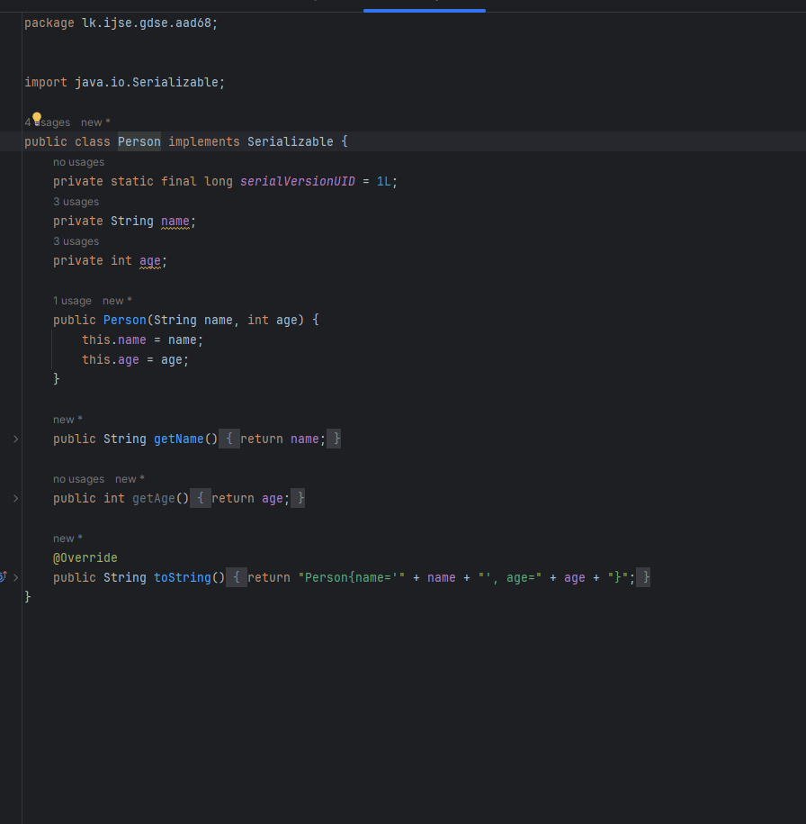

<h1>Serialization and Deserialization in JAVA</h1>
<h2>Intrduction</h2>

<b>Serialization-</b> is the process of converting an object's state into a byte stream, making it possible to save the object to a file, transmit it over a network, or store it in a database. 

<b> Deserialization -</b> is the reverse process, where the byte stream is used to recreate the original object. These processes are essential in distributed systems, data persistence, and communication between different components of a system.

<h2>Benefits of Serialization and Deserialization</h2>
<ol>
  <li><b>Data Persistence: </b>Objects can be saved to storage and retrieved later, ensuring data is not lost when an application closes.</li>
  <li><b>Communication:</b> Serialized objects can be transmitted over a network, enabling communication between different systems and components.</li>
  <li><b>Caching:</b> Serialized objects can be stored in caches, improving the performance of applications by reducing the need to repeatedly recreate complex objects.</li>
  <li><b>Distributed Systems:</b> Enables easy data sharing between distributed components, making it crucial for applications like microservices.</li>
</ol>
<h2>Mechanism of Serialization and Deserialization</h2>
<h3>Serialization</h3>

  <ol>
    <li><b>Marking a Class as Serializable:</b> The class should implement the Serializable interface.</li>
    <li><b>Creating an Output Stream:</b>An ObjectOutputStream is created to write the object to a byte stream.</li>
    <li><b>Writing the Object:</b>The object is passed to the writeObject method of the ObjectOutputStream.</li>
  </ol>

<h3>Deserialization</h3>

  <ol>
    <li><b>Creating an Input Stream:</b>An ObjectInputStream is created to read the byte stream.</li>
    <li><b>Reading the Object: </b>The readObject method of the ObjectInputStream is used to recreate the object.</li>
  </ol>

<h3>Example Code</h3>

Person class that needs to be serialized and deserialized.

<b>Person.java</b>

